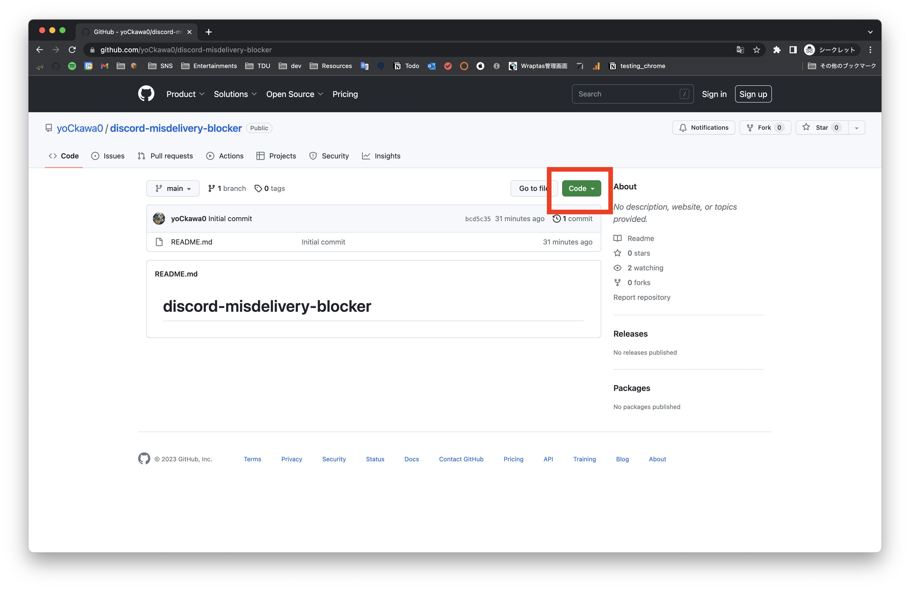
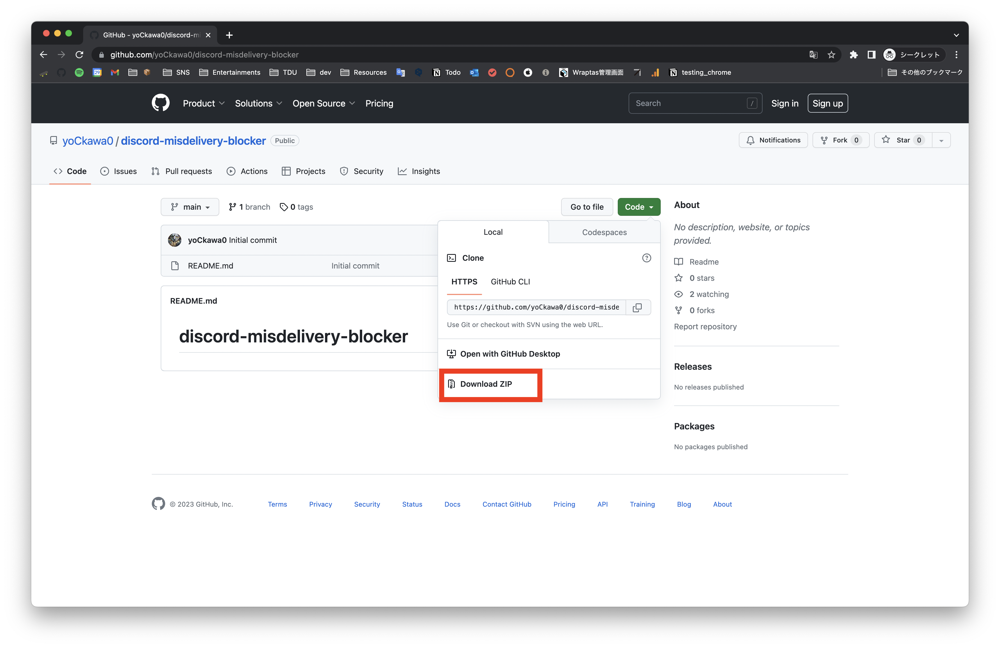
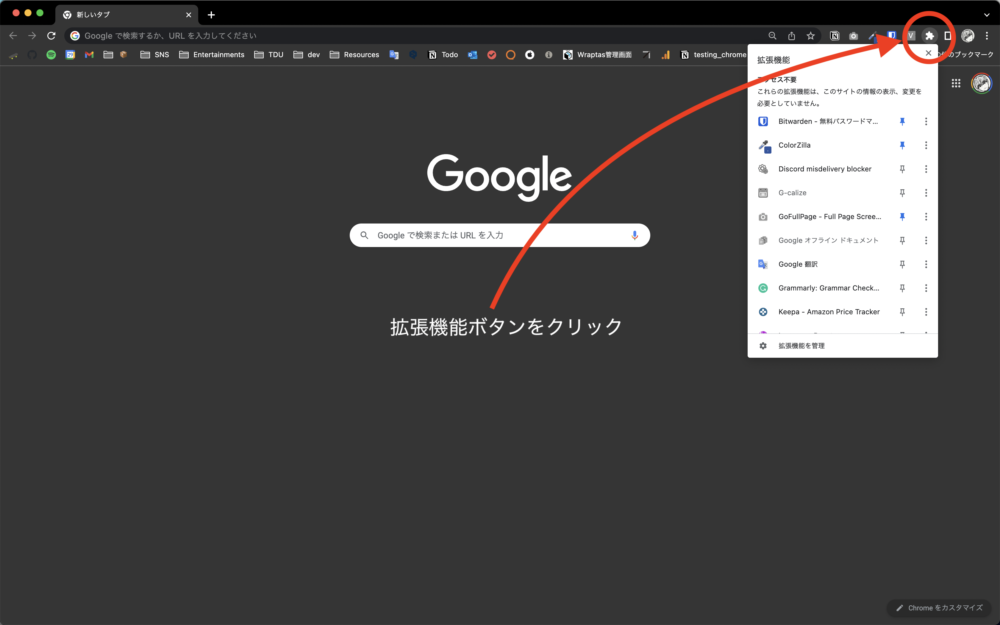
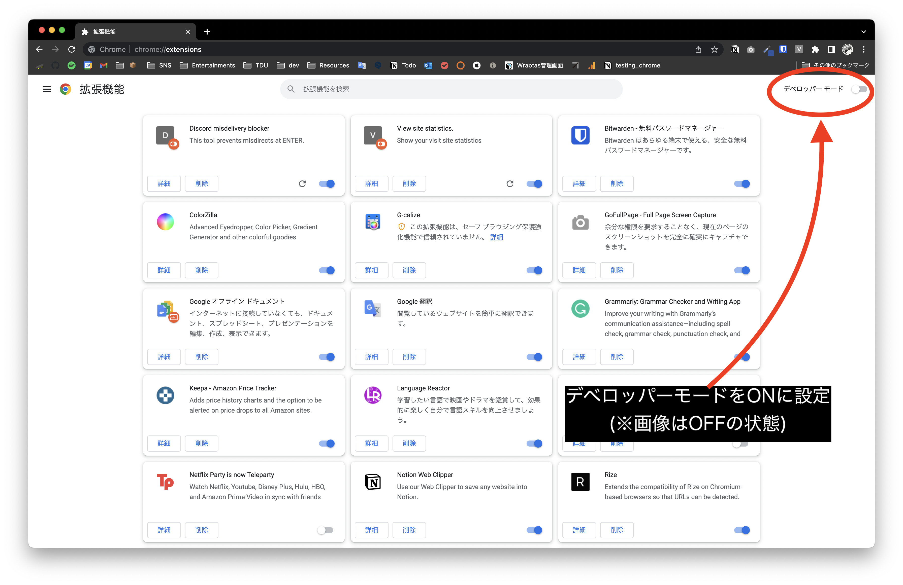
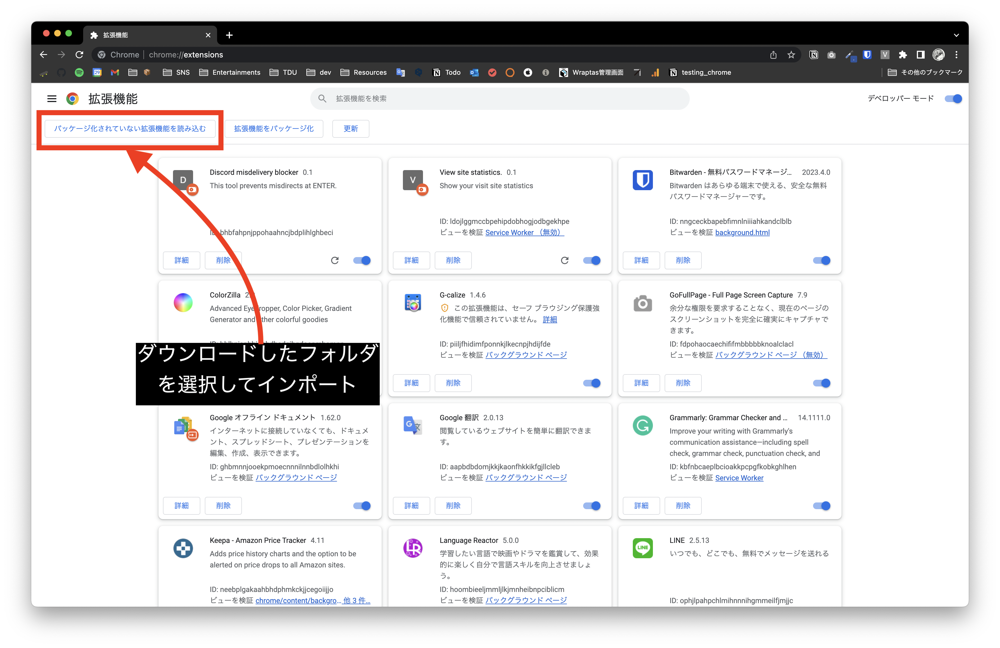

# discord-misdelivery-blocker

このツールはdiscordでEnterKeyを押し際に送信しないようにするChrome拡張です。
discordのクライアントアプリでは動作しません。

# Install

## Step1. ZIPのダウンロード

以下にアクセスしてCodeをクリック
<https://github.com/yoCkawa0/discord-misdelivery-blocker>

Download ZIPを選択してダウンロード

ダウンロードしたZIPを展開してください。

## Step2. chrome拡張のインポート
1. 拡張機能ボタンをクリック

2. デベロッパーモードをONに設定

3. ダウンロードして展開したフォルダを選択してインポート

